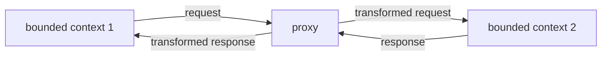
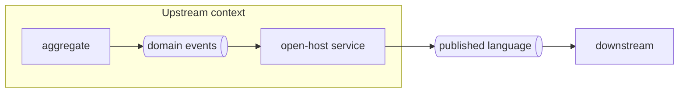
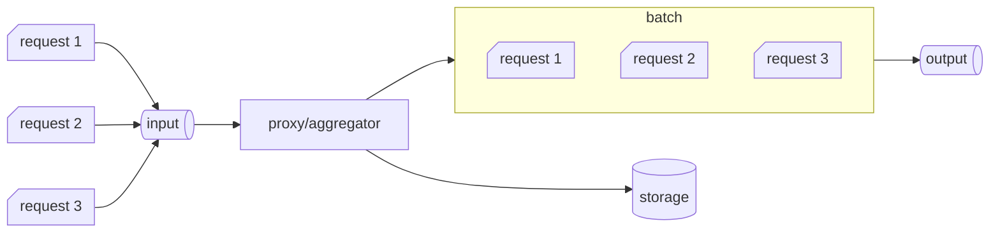
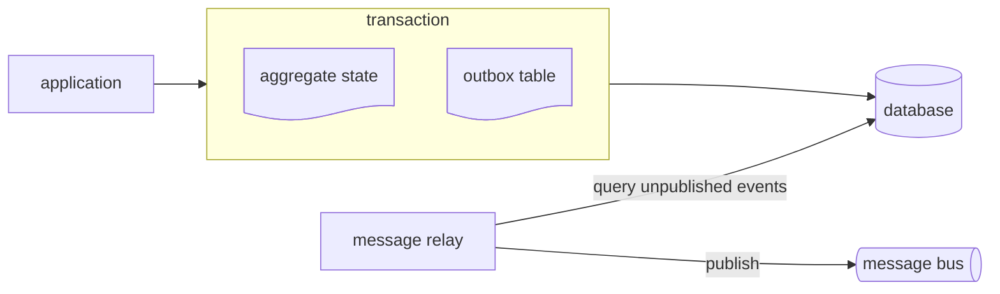

## Model translation  

A bounded context is the boundary of a model, a ubiquitous language. If in a communication across bounded context one of the two cannot conform, a model translation is required e.g. anticorruption layer, or open-host service. Model translation can be either *stateless*, which happens on the fly, or *stateful*, a more complex translation requiring a database.  

# Stateless model translation  
### Synchronous  

In a synchronous stateless translation the bounded context which owns the translation implements a proxy.  



These proxy, which sometimes are offloaded to external components such an *API gateway*, are integration specific bounded contexts and are mainly in charge to transform models for consumption. These are often called *interchange contexts*.  

### Asynchronous  

Similarly, in an asynchronous communication, we implement a *message proxy*. This is essential for open-host service, where you don't want to leak bounded context implementation but rather convert domain events to a published language.  



# Stateful model translation  

A use case is combining multiple fine-grained messages into a single message. To track incoming data and process it, the translation logic requires its own persistent logic.  




# Integrating aggregates  

One way for aggregates to communicate with the rest of the system is via domain events. A common mistake is to publishing the event from the aggregate it self.  

```python
class Campaign:
    ...
    def deactivate(self):
        self.is_active = False
        event = CampaignDeactivated(self.uid)
        self.events.append(event)
        self.message_bus.publish(event)
```

The event will be dispatched before the aggregate's new state is committed. A subscriber would receive the notification that the campaign is deactivated contradicting the campaign's state.  

## Outbox  

This pattern ansure reliable publishing of events as follows:  

* aggregate's state and events are committed in the same transaction
* a message relay fetches events from the database
* the message relay publishes the events to a message bus
* the relay marks the events as published or deletes them



The message relay can fetch unpublished events in a **pull** manner (*polling publisher*), so quering unpublished events directly, or in a **push** fashion (*transaction log tailing*) where the relay it's called directly by a database's insert or update hook.  
