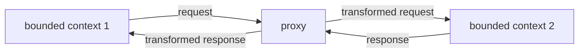
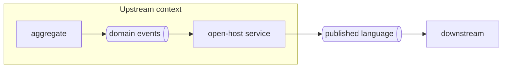
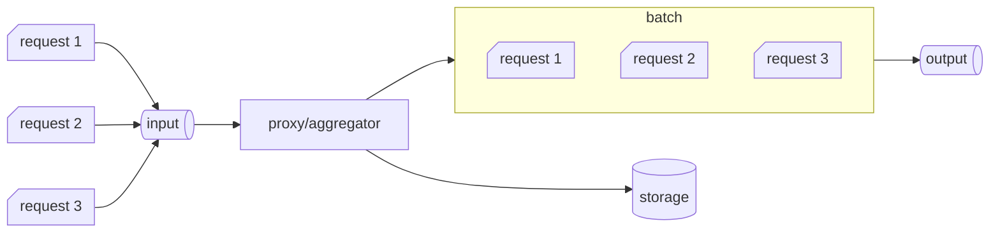

## Model translation  

A bounded context is the boundary of a model, a ubiquitous language. If in a communication across bounded context one of the two cannot conform, a model translation is required e.g. anticorruption layer, or open-host service. Model translation can be either *stateless*, which happens on the fly, or *stateful*, a more complex translation requiring a database.  

# Stateless model translation  
### Synchronous  

In a synchronous stateless translation the bounded context which owns the translation implements a proxy.  

These proxy, which sometimes are offloaded to external components such an *API gateway*, are integration specific bounded contexts and are mainly in charge to transform models for consumption. These are often called *interchange contexts*.  

### Asynchronous  

Similarly, in an asynchronous communication, we implement a *message proxy*. This is essential for open-host service, where you don't want to leak bounded context implementation but rather convert domain events to a published language.  

# Stateful model translation  

A use case is combining multiple fine-grained messages into a single message. To track incoming data and process it, the translation logic requires its own persistent logic.  

# Integrating aggregates  

