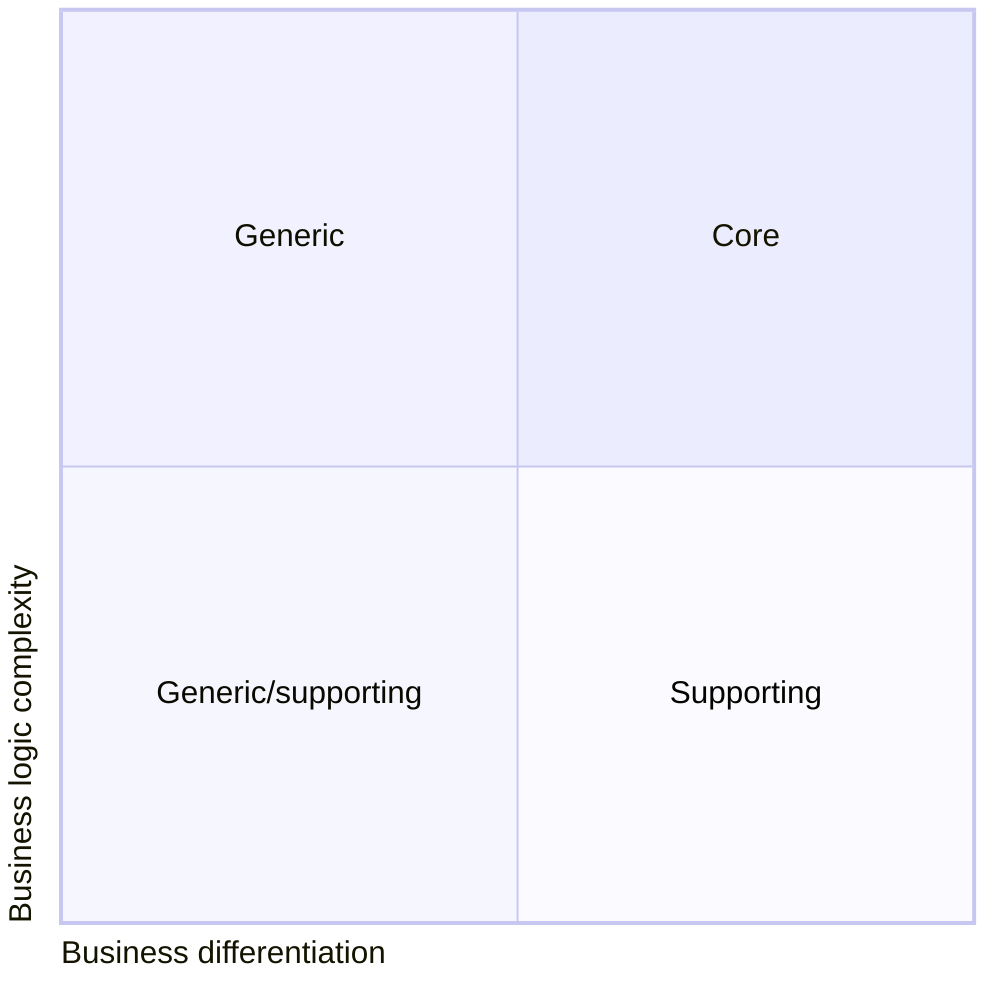
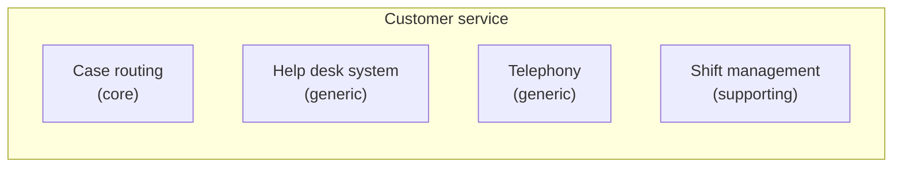

# Business domain  

It's the company's **main area of activity**, which can change overtime. The company could also operate in multiple business domains. Amazon for example provides both retail and cloud computing services.  

# Subdomain  

It's a **fine-grained area of activity**. Starbucks it's best known for its coffee, but building a successful coffeehouse chain requires way more than simply knowing how to make great coffee. You also need to manage finances, hiring staff etc... all these company's subdomains form its business domain. We'll differentiate between three types of subdomains:

* core
* generic
* supporting

## Core subdomains  

It's **what a company does differently from its competitors** as it contains the **source of competitive advantage**. Core subdomains are **naturally complex** since any simple implementation could only provide a short lived competitive advantage. Uber for example initially provided ridesharing, but as the competitors caught up they had to find ways to optimize its core business, for example by reducing costs by matching rider heading in the same direction.  

It's important to note that the **source of competitive advantage** may not necessarily be technical. For example in a company specialised in fraud detection, analysts will go through documents flagging potential fraud cases using a software system, but the software  it's not the core subdomain. The core domain is the work the analysts are doing.  

## Generic subdomains  

It's a business **activity that all companies are performing in the same way**. Most systems needs a user authentication mechanism, which **does not provide any competitive advantage** and therefore it makes more sense to use an existing solution.  

## Supporting subdomains  

These domains **support** the company's business **without providing competitive advantage**. The implementation is simple but customised enough such that existing solutions cannot be used. Coming back to the fraud detection company example, the way they store and index documents does not impact its profit and yet is essential to run the fraud detection system, that makes it a supporting subdomain.  

## More on subdomains  

Core subdomains brings both high differentiation and complexity, while generic subdomains have some complexity but since these problems have been solved by existing solutions they do not bring much differentiation. Supporting domains comes with great differentiation and low complexity.  

**Volatility** is another key feature, the nature of core domains makes them very volatile, companies continuosly innovate and evolve core subdomains to gain competitive advantage. Generic and supporting subdomains can change too but less frequently, they do not provide much competitive advantage and herefore there is also very minimal value in optimizing them compared to core subdomains.  

# Identifying subdomains boundaries  

Subdomains resemble sets of interrelated, coherent use cases usually involving the same actors (business entities) manipulating closely related set of data. Core domains are the most volatile and complex so it's important to identify them to allow for focused optimization, while the distillation can be somewhat relaxed on generic and supporting subdomains.  

For example by analysing a typical *customer service department* we'll see that is made of fine-grained components.  

While help desk and telephony systems are generic subdomains as they're problem solved by existing solutions, shift management is a supporting subdomain since some customisation is likely required. Finally, the algorithm for routing incidents to the best agents based on some criteria is a non trivial task which helps providing a better experience than its competitors making it a core subdomain.  

# Domain experts  

Are experts who knows all the intricacies of the business that we have to model and implement in code. They are knowledge authorities in the software's business domain and usually are either the people coming up with requirements or the software's end users. We are supposed to solve their problems. For example, in an online advertisement agency the domain experts would be the campaign managers, analysts or other business stakeholders.  

