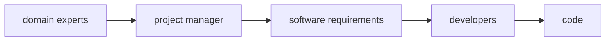

# Knowledge discovery and communication  

The software we build is meant to **solve business problems**. Now, in order to design effective solutions we need to have at least a basic understanding of the business domain, and given knowledge belongs to domain experts, our knowledge and by implication the project's success, depends on the **effectiveness of knowledge sharing** between domain experts and software engineers, in other words **communication** is key.  

In a typical software development cycle, domain experts' **knowledge is translated** into engineer-friendly by a mediator, usually a product owner/manager. This process which resembles the telephone game, often creates information distortion which in turn leads to software engineers implementing the wrong solution, or the right solution for the wrong problem.  

Domain-driven design proposes a better way to facilitate knowledge sharing between domain experts and developers through **ubiquitous language**.  

# Ubiquitous language  

To increase communication efficiency, we remove the need for translations by having both parties to speak the same language. Domain-driven design advocates for a **single language to describe business domains**: the ubiquitous language. Since ubiquitous language is the language of the business, it should not contain technical jargon, but rather aim to frame domain experts' knowledge mental model in terms that are easy to understand. For example consider the following statement in the context of an advertising campaign:  

> A campaign can be published only if it has at least one associated records in the active-placements table

This is purely technical and will be incomprehensible to domain experts. Reformulating the statement in the language of the business would result in something like:  

> A campaign can be published only if at least one of its placements is active

Ideally we should aim to be precise, consistent and explicit, eliminating the need to assumptions. Each term should have only one meaning. For example, let's say we have a context dependant term *policy* which could mean *regulatory rule* or *insurance contract*. Ubiquitous language therefore demands that the term *policy* should be modeled by using *regulatory term* and *insurance contrat* explicitly in their respective contexts.  

# Modelling the business domain  

> A model is a simplified representation of a thing or phenomenon that intetionally emphasizes certain aspects while ignoring others. Abstraction with a specific use in mind.  
> *- Rebecca Wirfs-Brock*

> All models are wrong, but some are useful  
> *- George Box*

That is to say that we create models to solve problems, and effective models contains only the details required to solve those problems. The ubiquitous language we use to model the business domain is not supposed to cover every detail, but rather include **just enough of the business domain** to make it possible to implement the software system that is intended to solve a business problem.  

Modelling the business domain is a **continuous effort** which can be alleviated by documentation. Not only documenting terminology but business domain's processes, roles and so on. Codebase should also be speaking the business language, for example by writing tests in a way that the expected behaviour of the system is potentially understandable by a domain expert.  

