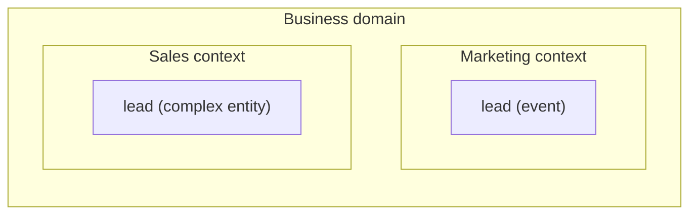
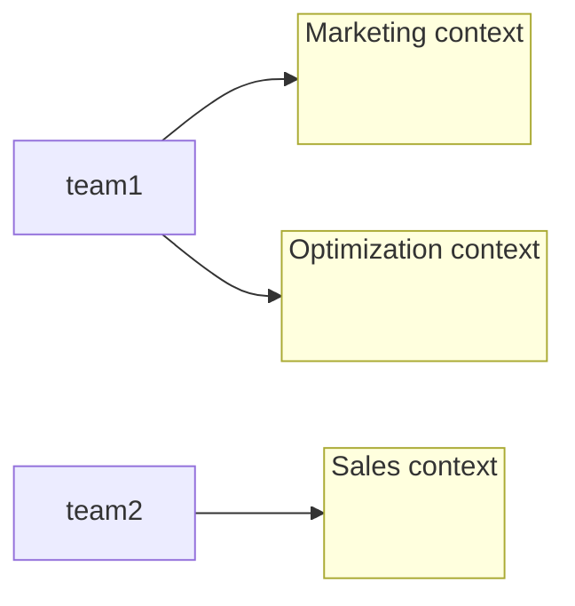

# Bounded context  

After examining the domain's expert language in a typical marketing and sales department we realised that the term *lead* has different meanings:  

* **Marketing** - a *lead* is the event of receiving the prospective customer's contact details
* **Sales** - a *lead* represent the entire lifecycle of the sales process

The Domain-driven design approach is to divide the ubiquitous language into  multiple smaller languages which will be bound to its context of application, the **bounded context**.  

Ubiquitous language is not universal, is really ubiquitous only within its bounded context where is consistent and follows the domain's expert mental model. The consitency of the language helps us to identify the boundary of the context e.g. it cannot be any large as otherwise terminology conflicts would arise.  

## Physical and ownership boundaries  

Unlike subdomains which are discovered by analysing the business domain, bounded context are strategically designed to define *physical and ownership boundaries*. Having a clear physical boundary allows to implement each bounded context with the technology that fits best. These boundaries can be in turn utilised to define ownership and distribute the work amongs different teams. Ideally a bounded context should be owned by a single team, while the same team could own multiple bounded contexts. This eliminates assumtions that teams might make about one another's model and force explicit communication whenever collaboration is required.  

The decision for how big the bounded context should be depend on the specific problem or situation. One could extract smaller bounded context out of a larger one to create a new team, separating development lifecycles or to gain the ability to scale independently from the rest of the larger bounded context functionality.  
