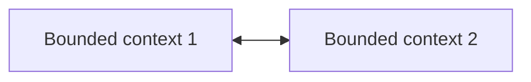
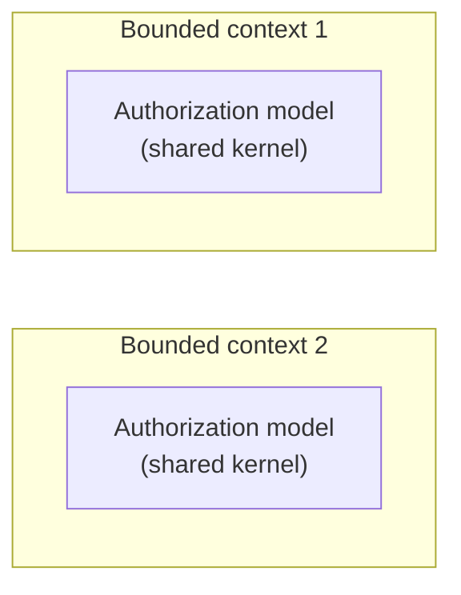
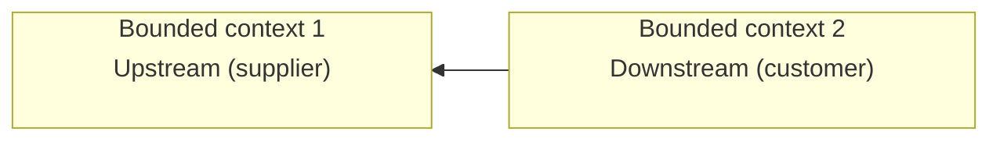
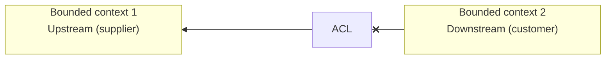
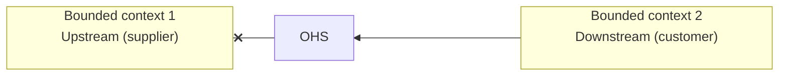

## Contracts  

In a system, components interact with one another to achieve a goal, so do bounded contexts, and as a result there will be touchpoints between them called **contracts**. Here we'll learn about integration patterns grouped by team collaboration type:  

* cooperation
* customer-supplier
* separate ways

# Cooperation  

When teams are cooperating neither of them is interested in blocking the other or dictating the integration contract, so teams can adapt to any contract change that may emerge.  

## Partnership  

The simplest scenario, one team notify the other about a change in the API which will adapt accordingly, no conflict or drama.  

## Shared kernel  

This is a sort of exception where the same model will be implemented in multiple bounded context, which kinda goes against Domain-Driven design itself, but hey it's a pragmatic exception that should be justified, usually applied when the cost of duplication is higher than the cost of coordination.  

Needless to say that every change in the kernel needs to be reflected in each bounded context. Not propagating the changes would lead to inconsistencies, data corruption or runtime errors.  

# Customer-Supplier  

In this type of collaboration we have an imbalance of power where either parties can dictate the integration contract.  

## Conformist  

When the upstream team has the power to dictate the integration contract, we say that the downstream team conform to the upstream model. This relationship is called *conformist*.  

## Anticorruption layer  

Here the power is still skewed towareds the upstream but the downstream doesn't want to conform implementing an anticorrutpion layer which translates the upstream model isolating the downstream from concepts that are not relevants.  

## Open-Host Service  

Here the supplier wants to protect customers from changes in its implementation model. It does this by exposing a protocol convenient for consumers called **published protocol** which can be versioned allowing consumers to migrate gradually. This decoupling protects the consumers and allows the supplier to evolve its implementation and public models at different rates. This essentially is the reversal of the anticorruption layer pattern.  

# Separate ways  

In this collaboration type there's no collaboration at all. When communication is difficult perhaps due to business size, it may be more cost effective to duplicate the functionality in multiple bounded context. Huge difference in bounded context could make any collaboration more expensive than duplicating the functionality. Needless to say that it should be avoided for core subdomain as it would defy the strategy of implementing them in the most effective and optimized way.  
