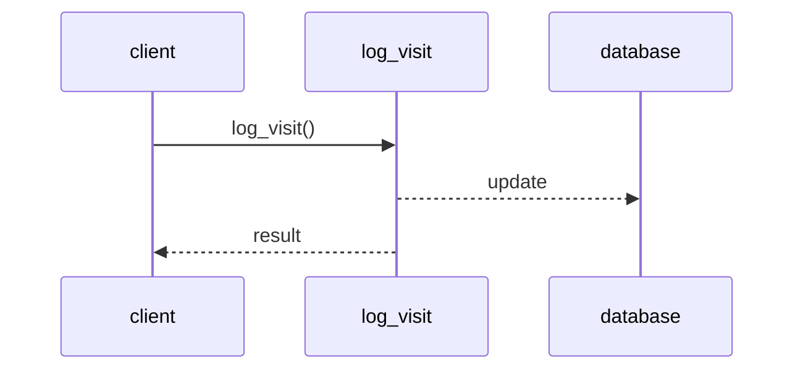

## Business logic  

Business logic is the heart of software and the reason software exist in the first place. If the software is not useful then it's nothing but an expensive tech demo. Here we'll explore two patterns to address simple business logic: transaction script and active record.  

# Transaction script  

In this pattern we expose procedures via some public interface and each procedure will execute a set of operations in a transactional fashion. Implementation-wise that means *each procedure should either succeed or fail but can never result in an invalid state*. Here is just some dummy code where we load the next job, execute it and mark it as completed.  

```python
from django.db import transaction

@transaction.atomic
def process_next_job():
    job = Jobs.load_next()
    outcome = job.process()
    return job.mark_completed(outcome)
```

By wrapping the logic in a transaction we ensure that, if the job was processed successfully, the data will be in a valid state and the business logic statisfied. While if any exception were to be raised at any point, the transaction will rollback and (assuming no side effects in called methods) any change will be reverted allowing for investigation.  

## Lack of transactional behaviour  

```python
from django.db import connections

def log_visit(user_id, visit_date):
    with connection.cursor() as cursor:
        cursor.execute("UPDATE auth_user SET last_visit = %s WHERE auth_user.id = %s", [visit_date, user_id])
        cursor.execute("INSERT INTO visitlog (user_id, last_visit) VALUES (%s, %s)", [user_id, visit_date])
```

Needless to say that if anything were to happen after the record in the *user* table was updated, the system will end up in an inconsistent state where the user has a new visit data, but there's no log for it. The root cause could be a network outage, a database timeout or a server crash. This can be fixed by wrapping the logic with `@transaction.atomic`.  

## Distributed transactions  

It's common practice in modern distributed systems to make changes to the data and notify other componets about it using a message bus.  

```python
from django.db import connections

def log_visit(user_id, visit_date):
    with connection.cursor() as cursor:
        cursor.execute("UPDATE auth_user SET last_visit = %s WHERE auth_user.id = %s", [visit_date, user_id])
    message_bus.publish("VISITS_TOPIC", {"user_id": user_id, "visit_date": visit_date})
```

Just like the previous example, if anything were to happen after updating the User table, the system will end up in an inconsistent state. Unfortunately there is no simple fix, distributed transactions spanning multiple storage mechanisms are complex and usually avoided.  

## Implicit distributed transaction  

```python
def log_visit(user_id):
    with connection.cursor() as cursor:
        cursor.execute("UPDATE auth_user SET visits = visist+1 WHERE auth_user.id = %s", [user_id])
```

This seemingly harmless pieace of code is actually an implicit distributed transaction as it communicates to the database and the process calling the function.  



If the method succeeed but the communication of the result to the client fails, let's say because of a network outage, then the client will assume failure and call `log_visit()` again resulting in incorrect increase of the `visists` counter. Once again there's no simple fix, it all depends on the business domain and its needs. One possible solution is to make the operation **idempotent**.  

```python
def log_visit(user_id, visists):
    with connection.cursor() as cursor:
        cursor.execute("UPDATE auth_user SET visits = %s WHERE auth_user.id = %s", [visits, user_id])
```

The client will have to read the counter, update it and pass it as a parameter. Executing the operation multiple times won't change the end result.  

Another apporach could be to assume optimistic concurrency, just read the counter and pass it as a parameter. Subsequent calls for the same input won't have any effect since we're filtering on `expected_visists`.  

```python
def log_visit(user_id, expected_visits):
    with connection.cursor() as cursor:
        cursor.execute("UPDATE auth_user SET visits = visits+1 WHERE auth_user.id = %s AND visits = %s", [user_id, expected_visits])
```

# Active record  

```python
def create_user(user_details):
    user = User()
    user.name = user_details.name
    user.email = user_details.email
    user.save()
```

Instead of accessing the database directly, we rely on an abstraction, these *active records* are simply **Django ORM** objects. Active records, aside of being responsible for persistence, can implement business related procedures too. Active record pattern is essentially a transaction script with optimized database access.  
