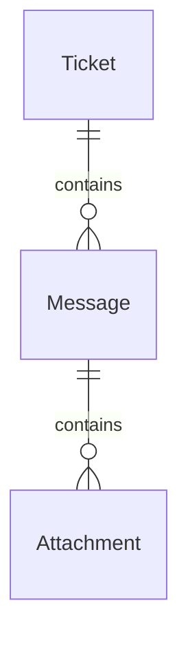
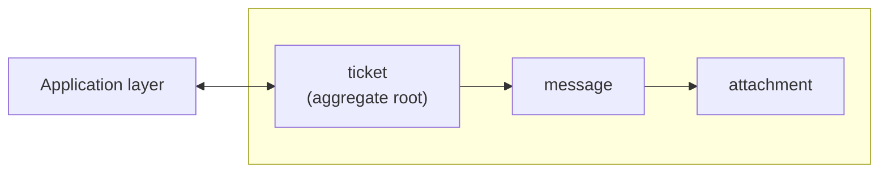
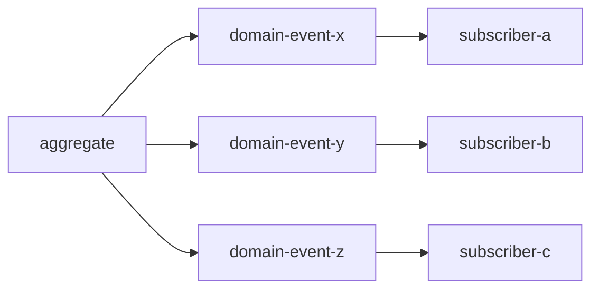

# Domain model  

As the business logic become more complex we find ourselves dealing with complicated states transitions and **invariants**: rules that needs to be protected at all times. To cope with this we'll use the *domain model* pattern. A domain model is an object which models a specific domain incorporating behaviour and data. A bit like an active record on steroids, but unlike active record the domain model is supposed to deal with business logic only without introducing any extra complexity like infrastructural or technological concerns such calls to databases. Here we'll explore the building blocks of the domain model...  

# Value Objects  

A value object is an immutable object that is **identified by its properties**. The combination of red, green and blue defines a color, and no two colors can have the same values. By being an immutable object, whenever an action results in a new color we return a new one.  

```python
@dataclass(frozen=True)
class Color:
    red: int
    green: int
    blue: int

    def mix_with(self, other: "Color"):
        return Color(
            red=self.red + other.red,
            green=self.green + other.green,
            blue=self.blue + other.blue,
        )        
```

## Primitive obsession  

```python
@dataclass(frozen=True)
class Person:
    person_id: int
    first_name: str
    last_name: str
    phone_number: str
    height: str
```

Depending on the use case relying exclusively on primitives could lead to duplication and validation issues. A better approach would be to push down validation and logic in their own value objects.  

```python
@dataclass(frozen=True)
class Person:
    person_id: PersonId
    name: Name
    phone: PhoneNumber
    height: Height

person = Person(
    person_id=PersonId(1234),
    name=Name("Les", "Grossman"),
    phone=PhoneNumber.parse("07123456789"),
    height=Height.from_metric(170),
)
```

Validation is now responsibility of these value objects where the decoupling makes also easier to implement internal logic and conversions.  

```python
height_metric = Height.from_metric(170)
height_imperial = Height.from_imperial(5, 4)

>>> str(height_metric.to_imperial())
"5 feet and 6.9 inches"

>>> height_metric > height_imperial
True
```

These objects can encapsulate logic to parse input data creating richer objects that express clear intent and are intuitive to use.  

```python
phone = PhoneNumber.parse("+4407123456789")

>>> country = phone.country
"GB"

>>> phone_type = phone.type
"MOBILE"
```

Coming back to the color example...  

```python
red = Color.from_rgb(255, 0, 0)
green = Color.from_rgb(0, 255, 0)
yellow = red.mix_with(green)

>>> yellow.to_hex()
"FFFF00"
```

# Entities  

| id  | first name | last name |
| --- | ---------- | --------- |
| 1   | Jack       | Simple    |
| 2   | Les        | Grossman  |
| 3   | Les        | Grossman  |
| 4   | Alpa       | Chino     |

An entity is an object identified by a **unique identifier**. Two person could have the same name hence the need for an identifier independent from any other feature. Entities are expected to change except from their unique identifier.   

```python
@dataclass
class Person:
    person_id: PersonId
    name: Name
```

# Aggregates  



The pattern *"aggregates"* a hierarchy of entities and value objects which are **bound by the same business logic**. Since entities can change overtime, aggregates provide a consistency enforcement boundary by providing a public interface which validate inputs and enforce invariants via transactions.  

```python
class Ticket:
    ...

    def add_message(self, user, msg):
        new_msg = Message(user=user, msg=msg)
        self.messages.append(new_msg)
```

It become easier then for application layers to orchestrate ticket operations...  

```python
class TicketAppLayer:
    @classmethod
    def automatic_response(cls, ticket_id, response):
        ticket = TicketRepo.load(ticket_id)
        outcome = ticket.add_message(ticket.user, response.msg)
        TicketRepo.save(ticket)
        return outcome

>>> TicketAppLayer.automatic_response(1234, AutoResponse.Done)
```

# Aggregate root  



The aggregate root is the entity responsible to expose the public interface that allows its state to be modified according to the business rules. In this example modifying the state of a message is only accessible via the aggregate root `Ticket`.  

```python
class Ticket:
    ...

    def acknowledge_message(self, msg_id):
        msg = self.messages.get(msg_id)
        msg.read = True
```

# Domain events  

A domain event is an object describing something significant that happened in the business domain. It should provide all the necessary data related to the event.  

```python
{
    "ticket_id": "f0d55031-8015-4447-8904-dcdb3c3123b3",
    "event_id": 164,
    "type": "escalated",
    "reason": "missed-sla",
    "timestamp": 
}
```

By publishing the event other processes and aggregates can subscribe and react to those events.  



```python
class Ticket:
    ...
    domain_events: list[DomainEvent]
    ...
    def request_escalation(self, escalation_request):
        if not self.is_escalated and not self.time_left:
            self.is_escalated = True
            escalated_event = TicketEscalated(escalation_request)
            self.domain_events.append(escalated_event)
```

Later we'll see how we can publish events to interested subscribers.  

# Domain services  

A domain service is a stateless object which holds *business logic that doesn't naturally belong to any specific aggregate or value object*. It helps coordinating the work of multiple aggregates although the principle of single transaction per aggregate should still be respected.  

```python
class ResponseTimeFrameService:
    @classmethod
    def calculate_agent_response_dead_line(cls, agent_id, priority, escalated, start_time):
        agent = AgentRepo.get_agent(agent_id)
        policy = agent.policy
        max_resp_time = policy.get_sla(priority)

        if escalated:
            max_resp_time = max_resp_time * policy.escalation_factor
        
        shifts = agent.get_upcoming_shifts(start_time)
        return cls.calculate_target_time(
            max_resp_time,
        )
```