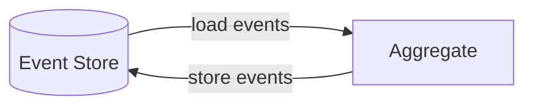

# Event-sourced domain model  

Instead of actively maintaing aggregates and emitting events, the event-sourced domain model leverage existing domain events to reconstruct a state representation of the aggregates. The source of truth for events is the **event store**.  



The event store may as well be one or more database tables, as long as it's possible to store and retrieve events belonging to a specific entity to reconstruct its state. If these conditions are satisfied the pattern goes as follows:  
1. load domain events
2. reconstruct the aggregate state
3. execute business rules to produce new events
4. store new events in the event store

```python
class TicketAPI:
    def request_escalation(cls, ticket_id, escalation_request):
        events = TicketRepo.load_events(ticket_id)
        ticket = Ticket.from_events(events)
        ticket.request_escalation(reason)
        TicketRepo.persist(ticket)
```

Note that the `TicketApi` perform the exact four fundamental steps of the event-sourced domain model. While in this new verions of `Ticket` class we have hydration logic in the `from_events` factory method, a `process_event` method to project the state according the events, and finally a `request_escalation` method which produce the event accoring to some business rules.   

```python
@dataclass
class Ticket:
    ticket_id: int | None = None
    is_escalated: bool = False
    version: int = 0
    domain_events: list["DomainEvent"]

    @classmethod
    def from_events(cls, events: list["DomainEvent"]):
        ticket = cls()
        for event in events:
            ticket.process_event(event)
        return ticket

    def process_event(self, event: "DomainEvent"):
        if isinstance(event, TicketInitialized):
            self.ticket_id = event.ticket_id
        elif isinstance(event, TicketEscalated):
            self.is_escalated = True
            self.version +=1
        self.domain_events.append(event)

    def request_escalation(self, escalation_request):
        if not self.is_escalated and not self.time_left:
            event = TicketEscalated(escalation_request)
            self.process_event(event)
```

## Advantages 

1. **time traveling** - the ability to reconstruct the aggregate state as of any point in time could help in analysing system behaviour, debugging or optimizing business logic
2. **audit log** - the event store will essentially act as an audit log provider for everything that has happened to the aggregates' states
3. **deep insight** - event sourcing already provide deep insight into the system state and behaviour, and ability to create new arbitrary projections could provide additional insights
4. **advanced occ** - instead of raising an exception, we can load and examine the competing events to make a business domain-driven decision on how to handle the situation

### Disadvantages  

1. **learning curve** - it's substantially different from traditional data management techniques so unless already familiar we should take the learning curve into account
2. **evolving the model** - changing the event schema may be challenging, see [versioning event sourced systems](https://github.com/luque/Notes--Versioning-Event-Sourced-System)
3. **architectural complexity** - the implementation introduce numerous moving parts increasing complexity
