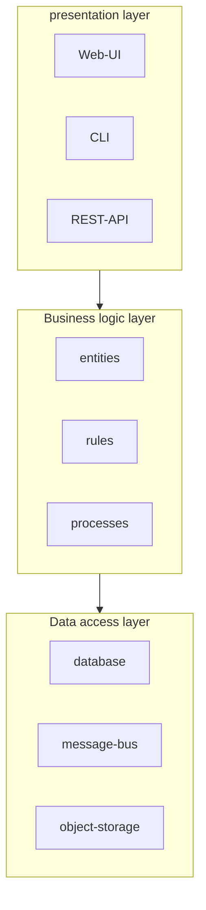
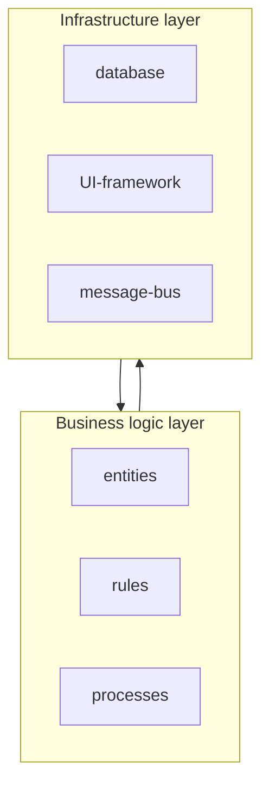
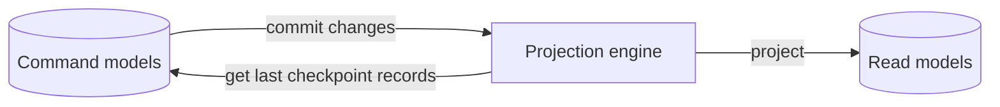
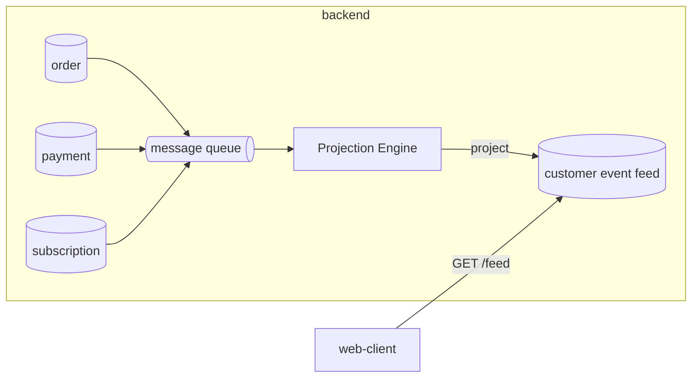

Here we'll explore common application architecture patterns: layered architecture, ports & adapters, and CQRS.  

# Layered architecture  

This pattern organises the codebase into three main layers:  

1. **presentation layer** - where the interaction with consumers happens, the public interface
2. **business logic layer** - where the business logic lives, the heart of software
3. **data access layer** - the layer providing access to any persistence mechanisms



The communication happens in a top-down fashion, where for example the presentation layer references only the business logic layer and has no knowledge of the data access layer.  

## Service layer  

The pattern often comes with an extra *service layer* acting as a facade for the business logic layer. It exposes interfaces that match with public interface methods and implement the logic required for the layer underneath.  

* it can be reused for multiple public interfaces
* improves modularity
* decouples presentation and business logic layer
* ease testing

```python
class CampaignManagementService:
    ...
    @classmethod
    def create_campaign(cls, campaign_details):
        ...
    @classmethod
    def publish(cls, campaign, publishing_schedule):
        ...
    @classmethod
    def deactivate(cls, campaign):
        ...
```


# Port & Adapters  

  

Also known as **hexagonal architecture** or **onion architecture**, this pattern places the business logic at the core. The outermost layer is the infrastructure layer, which contain integration with external components such user interface, databases etc.. and it implements **adapters** which will connect to the **ports** exposes by the bussiness logic layer, the innermost layer.  



An application layer could be placed in between acting as a facade for the business logic just like the service layer in the layered architecture.  

# Command-Query Responsibility Segregation  

The main purpose of pattern is to enabled data representation in multiple persistent models. It does it by separating the responsibilities of **system commands**, where the business logic happens, to the **queries** or **read models**. It's useful for applications that need to work with same data in multiple models, potentially stored in different databases.  

|                |                                |
| -------------- | ------------------------------ |
| 10.12.24 14:53 | Order payment for #1234        |
| 10.12.24 14:57 | New order for #1234            |
| 11.12.24 16:05 | Subscription for #1234         |
| 11.12.24 16:15 | Subscription payment for #1234 |

As an example let's assume our system has an *order*, *payment* and *subscription* service, and we want to produce a **customer events feed**.  

## Synchronous projections  

In the synchronous implementation there's a projection engine which:
1. queries the databases for added/updated records after the last checkpoint
2. creates a new projection of those records and update the read models
3. store the checkpoint of the last processed records to be used in the next iteration



A checkpoint could be an autoincremental integer at SQL level upon INSERT or UPDATE.  

## Asynchronous projections  

In the asynchronous version, the command model would publish events for the projection engine which in turns generate new projections for the read model.  



Worth noting that this pattern could work nicely with event-sourced domain models, where is impossible to query records based on aggregates' states, while CQRS makes this possible by persisting projections into a queryable database.  

