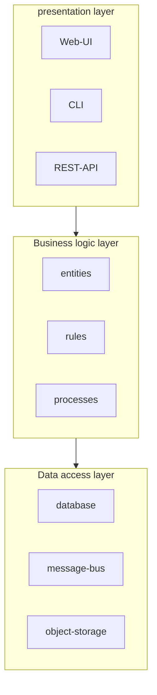
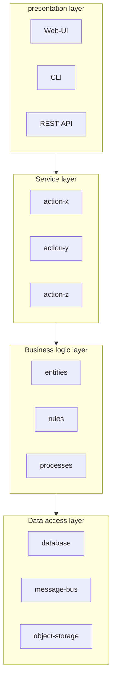

Here we'll explore common application architecture patterns: layered architecture, ports & adapters, and CQRS.  

# Layered architecture  

This pattern organises the codebase into three main layers:  

1. **presentation layer** - where the interaction with consumers happens, the public interface
2. **business logic layer** - where the business logic lives, the heart of software
3. **data access layer** - the layer providing access to any persistence mechanisms



The communication happens in a top-down fashion, where for example the presentation layer references only the business logic layer and has no knowledge of the data access layer.  

## Service layer  

The pattern often comes with an extra *service layer* acting as a facade for the business logic layer. It exposes interfaces that match with public interface methods and implement the logic required for the layer underneath.  

* it can be reused for multiple public interfaces
* improves modularity
* decouples presentation and business logic layer
* ease testing

```python
class CampaignManagementService:
    ...
    @classmethod
    def create_campaign(cls, campaign_details):
        ...
    @classmethod
    def publish(cls, campaign, publishing_schedule):
        ...
    @classmethod
    def deactivate(cls, campaign):
        ...
```



# Port & Adapters  
