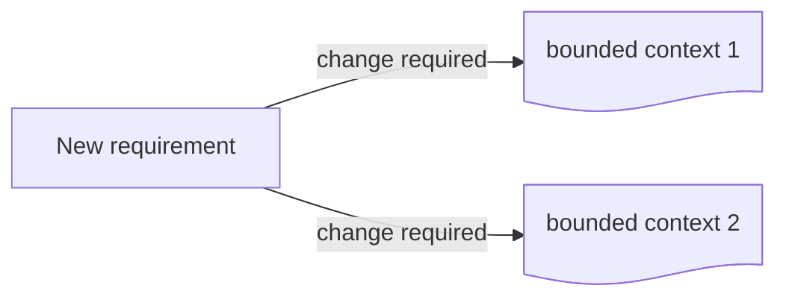
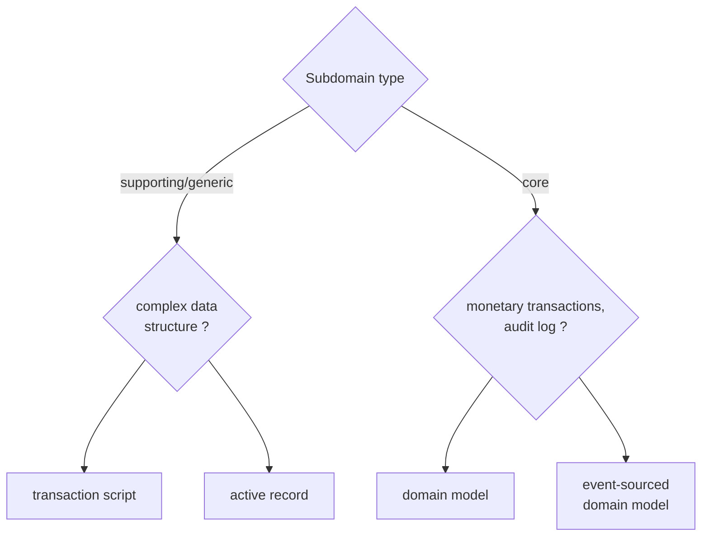
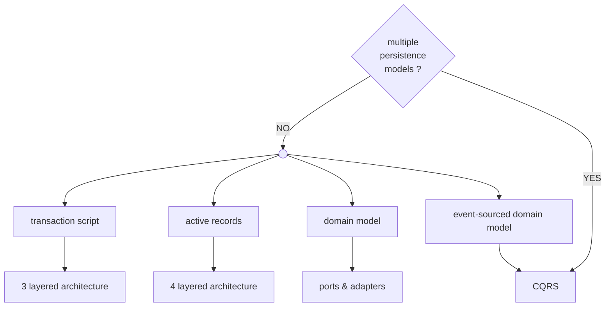

## Heuristic  

Is any approach to problem solving that employs a pragmatic method that doesn't necessarily works every time, but it's *good enough*. It's a rule of thumb, not guaranteed to be perfect, in other words, is yet another model :)  

# Bounded context  

Changes affecting multiple bounded context are expensive, and could signal ineffective bounded context's boundaries. Volatility and uncertainty, specially at early stage of implementation, plays a big role. We can use it as heuristic when designing bounded context boundaries. Broad bounded context boundaries make it safer to be wrong, and if necessary you can always decompose wider boundaries into smaller ones as we gain domain knowledge.  

# Business logic implementation patterns  

An effective heuristic for choosing the appropriate implementation is to ask questions about the nature of the subdomain. Since there's a strong relationship between a subdomain complexity and its type we can visualize the heuristic as a decision tree.  

# Architectural patterns  

Once the business implementation is known, choosing the architectural pattern is relatively straightforward:

* event-sourced domain model needs CQRS to avoid querying limitations
* domain model is best served by port & adapters to make aggregates and value objects ignorant of persistence
* active records fits nicely with layered architecture, with the service layer controlling the active records
* transaction scripts can be implemented with minimal layer architecture

# Testing strategy  

  

### Testing Pyramid  

Aggregates and value objects makes perfect units for testing business logic, hence **domain model** patterns fits well with this strategy.  

### Testing Diamond  

**Active records** causes business logic to spread between layers which makes the testing diamond an effective choice.  

### Reversed Testing Pyramid  

**Transaction script** with its simple logic and minimum number of layers makes it a good fit for the reversed pyramid.  

