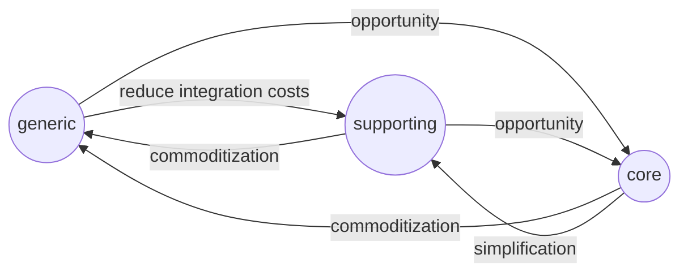

### Continuous evolution    

Companies evolves at a fast pace and need to do so to keep up with the competition. As a result, we need to design systems to support continuous evolution. Here we'll examine four common reasons for change: business domain, organizational structure, domain knowledge and growth.  

# Changes in domain  



* **core to generic** - a company disrupt the industry by providing your core subdomain as an off-the-shelf product, so what was previously considereded a competitive advantage is now available to any competitor. Your core subdomain is now a generic subdomain
* **generic to core** - when you invest in your off-the-shelf solution to optimize it and eventually making it a core subdomain. Amazon for example, was able to reinvent its infrastructure, eventually turning it into a profitable business: *Amazon Web Services*
* **supporting to generic** - your company initally implements an in-house solution, but after a while better off-the-shelf product becomes available and you decide to adopt it
* **supporting to core** - the company may find a way to optimize the supporting logic such that it will reduce the costs or generate additional profits, with the typical symptom of increased complexity. This is a sign of supporting subdomain becoming a core subdomain
* **core to supporting** - if overtime the complexity of the core subdomain isn't justified anymore, the company may decide to reduce it to the minimum logic required to support the implementation of other subdomain
* **generic to supporting** - if the complexity of integrating with the off-the-shelf product isn't justified anymore, the company may come back to an in-house solution

## Design concerns  

The inability of existing technical design to support current business needs is the main indicator of a change in subdomain's type. When complicated rules and invariants are added to what previously was a simple business logic implemented with simple patterns like transaction script and active records, complexity increases making it *painful* to add new functionality. This *pain* is an important signal which can be used to make design choices.  

### Transaction script to active record  

When working with data becomes challenging you can refactor the transaction script into the active record pattern. Instead of accessing the database directly, use active record to encapsulate storage mechanism complexity.  

### Active record to domain model  

If business logic becomes complex with inconsistencies and duplication, it may be reasonable to refactor it to the domain model pattern:

1. identify potential value objects and move related business logic inside them
2. refactor active records to move state-modifying logic inside them

```python
# BEFORE
class Player:
    uid: uuid
    points: int

def apply_bonus(player_id, percentage):
    player = PlayerRepo.load(player_id)
    player.points *= 1 + percentage/100
    PlayerRepo.save(player)

# AFTER
class Player:
    uid: uuid
    points: int
    
    def apply_bonus(self, percentage):
        self.points *= 1 + percentage/100
```

When business logic is moved inside their relevant boundaires, a hierarchy will likely emerge, this will signal good candidates for aggregates and their aggregate roots.  

### Domain model to event-sourced domain model  

If your domain model has reasonably designed boundaries, you could transition to an event-sourced domain model by modeling the domain events needed to represent the aggregate lifecycle. If past events does not exists you have two options:  

1. **generating past transistions** - generate past events on a *best-effort* basis knowing the history is incomplete
2. **modeling migration events** - acknowlegde the lack of past events and explicitly model it as an event e.g. *LegacyEvent*

# Organizational changes  

When a company grows in one area, adding new dev team could cause existing wider bounded context to split. Changes in organizational structure can affect team's communication and collaboration and in turn bounded context integrations. For example, by assignign a bounded context to a distant dev team, the communication will likely be negatively affected, causing the collaboration to move from *partnership* to *customer-supplier*.  

# Domain knowledge  

Acquiring domain knowlegde is the most challenging aspect of software engineering. Modeling is an ongoing process, specially for core subdomain where the business logic is complicated and volatile. Is useful to design boundaries according to the domain knowledge level. The lesser the knowledge, the broader the boundary, which can always be decomposed as more domain knowloedge is gained.  

# Growth  

When new funcionality is continuosly added is a sign the system is successful. Growth is a sign of a healthy system. As new functionality is added is important to re-evaluate design decisions with respect to boundaries.  

* **subdomains** - identify cases of a subdomain spanning mulitple finer-grained subdomains
* **bounded-contexts** - revisit bounded contexts' boundaries to make them solve specific problems
* **aggregates** - eliminate accidental complexity by extracting functionality into a dedicated aggregate

