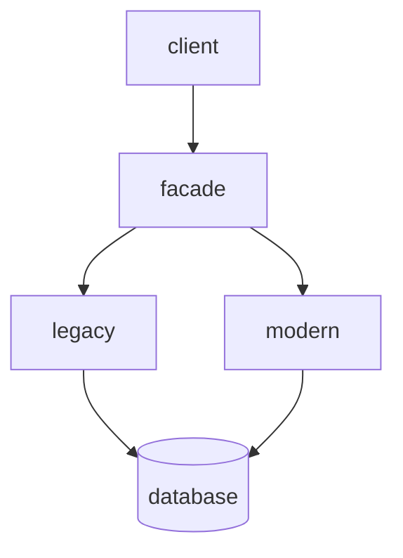

# Strategic analysis  

More often than not you'll be working on an existing balls-of-mud codebases which are the ones who can benefit from DDD the most. In order to make any design decision we have to start analysing the codebase.  

* what is the company business domain ?
* who are its customers ?
* what service/value it provides to them ?
* what companies/products is competing with ?

Get the big picture and then zoom into the *subdomains*...  

* **core** - does the company have a *secret sauce* or algorithm designed in-house ? due to their nature are often big balls-of-mud
* **generic** - look for the *off-the-shelf* solutions
* **supporting** - cannot be replaced by off-the-shelf solutions but does not provide competitive advantage, so effects of suboptimal design are less sever than for core subdomains

#### Evaluate current tactical design  

Look at existing high-level components/boundaries (boundaries in a non DDD sense) and evaluate whether existing solutions fits the complexity of the problem, what patterns are used ? (transaction script, active records etc..)  

#### Evaluate current strategic design  

Identify exisiting relationships between high-level components:  
* are multiple teams working on the same component ?
* is there any core subdomain implementation duplication ?
* akward models spreading around ?

# Modernization strategy  

System rewrites from scratch are rarely successful and difficult to sell to management anyway. A safer approach is to think big but start small. An effective and harmless first step is to start aligning namespaces, modules and packages with the subdomain boundaries.  

| marketing bounded context before | after                           |
| -------------------------------- | ------------------------------- |
| marketing/application.py         | marketing/advertising_material/ |
| marketing/infrastructure.py      | marketing/campaigns/            |
| marketing/models.py              | marketing/optimization/         |
| marketing/mobile.py              | marketing/publishing/           |
| marketing/services.py            |                                 |

## Strategic modernization  

If multiple teams are working on the same codebase, we can think of decoupling the dev lifecycle by defining bounded context for each team. Relocate conflicting models used by different components into separate bounded contexts. When the minimum required bounded contexts are in place look out for problems that could be addressed by context integration patterns.  

* **customer-supplier** - when partnership is no longer sustainable we could think of refactoring into customer-supplier relationship
* **anticorruption layer** - use it to protect contexts from legacy systems or frequent changes
* **open-host service** - use it to protect consumers from implementation changes
* **separate ways** - if the functionality that causes friction is not business critical each team can go and implement their own solutions

## Tactical modernization  

Watch out for the most painful mismatches between business value and implementation e.g. subdomains implementing patterns that does not match the complexity of the model. These will change frequently and painful to maintain. Once equipped with domain knowledge and its models we can decide on the modernization strategy: gradually replacing whole components aka *strangler pattern*, or gradually refactoring existing solutions.  

### Strangler pattern  

Named after [strangler fig](https://en.wikipedia.org/wiki/Strangler_fig) due to resemblance in dynamics: as the strangler grows on the host tree, it overshadows it leading to its death. Usually it goes in tandem with the *facade pattern* where a thin abstraction layer act as the public interface to route request appropriately. In this scenario is ok to use the same storage as the legacy context will soon retire anyway.  

### Refactoring tactical design decisions  

Think big start small, don't refactor transaction script into event-sourced domain model. Take the intermediary step of simple aggregates. Apply small incremental refactoring e.g. look out for potential value objects and move related logic inside them.  

# Cultivate ubiquitous language  

Listen carefully to stakeholders' language and avoid technical jargon but rather steer terminology towards its business meaning. Watch out for inconsistent terms, ask for clarifications. If different models are intertwined in the same solution, look for contexts and make them explicit. Use ubiquitous language in the codebase and don't forget to let the business domain drive design decisions!
