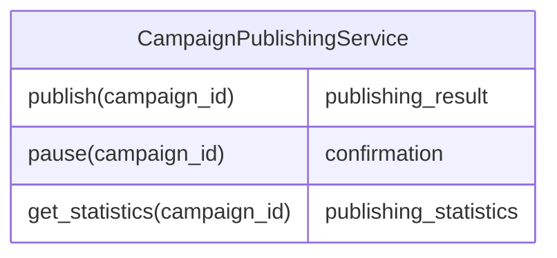
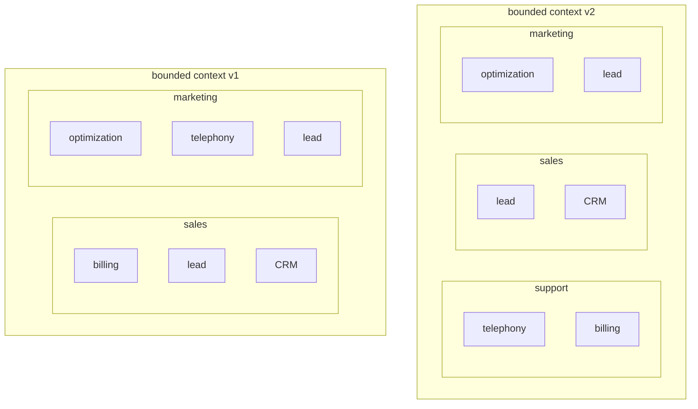

# Microservices  

A **service** is a mechanism that enables access to one or more capabilities via a prescribed interface, where the interface is any mechanism for getting data in or out of the service. A well expressed interface should be enough to describe the service functionality.  

Since a service is defined by its public interface, a **microservice** is a *service with a micro public interface*. This simplistic definition could make you think that limiting service interfaces to a single method would make it a perfect microservice. Even though each microservice would end up being much simpler reducing **local complexity**, the integration complexity between the resulting number of microservices would increase creating **global complexity**. So one needs to find the sweet spot, the global optima which balances both complexities.  

## Microservices as deep modules  

While microservices are strictly physical, modules can denote both logic and physical boundaries. Aside from that both concepts and their underlying design principles are the same. [A Philosophy of Software Design](https://blog.pragmaticengineer.com/a-philosophy-of-software-design-review/) proposes a simple yet powerful visual heuristic for evaluating a module's design: **depth**.  

  

According to this model effective modules (just like microservices) are deep: a simple interface encapsulating complex logic. If we decompose a monolith into services the cost of introducing a change goes down, and minimized when **decomposed into microservices**. However past the microservice threshold, the services will become more and more shallow, and as the interfaces increase so does the cost of integration.  

> **BBoM** stand for *Big Balls of Mud*

  

# Microservices' boundaries  
### Bounded contexts  

Both bounded contexts decompositions in the diagram are valid, but doesn't make them valid microservices, specially considering their wide functionalities. So although microservices are bounded contexts, not every bounded context is a valid microservice. The relationship between the two is not symmetrical.  

  

Here we can observe a safe decomposition area, past the bounded context or microservices' threshold, it will result in a *BBoM* or a *distributed BBoM*.  

### Aggregates  

While a bounded context impose a limit on the widest valid boundary, the aggregate's boundary represents the narrowest boundary possible. Usually if the aggregate has a strong relationship with other business entities of its subdomain it will result in a shallow individual service.  

### Subdomains as a service  

Therefore a more balanced heuristic for designing microservices is to align the its boundary with the subdomain. The coherent nature of the usecase contained in a subdomain ensures the module's depth making it a safe heuristic that produces optimal solutions for the majority of microservices.  

  

Finally to compress microservices interfaces and making them deeper we can introduce either the **open-host service** or the **anticorruption layer** pattern. These will expose a restrained model designed around intergation needs, encapsulating implementation details and reducing global complexity.  
