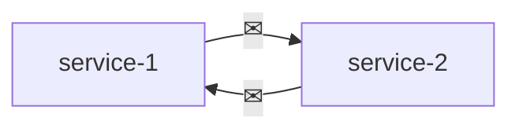
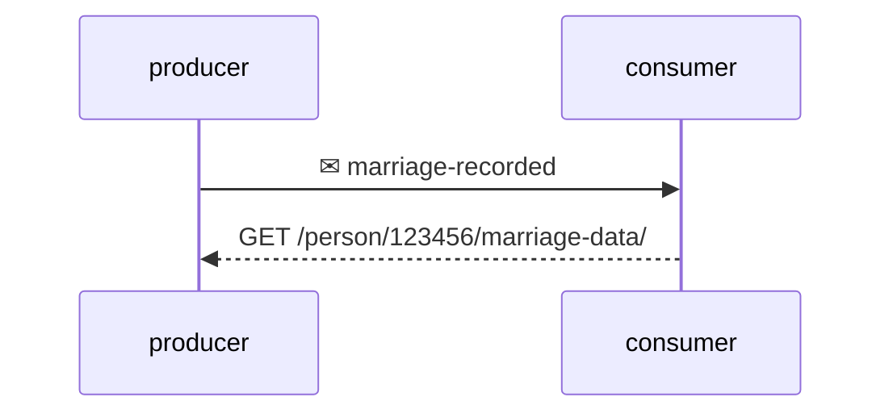
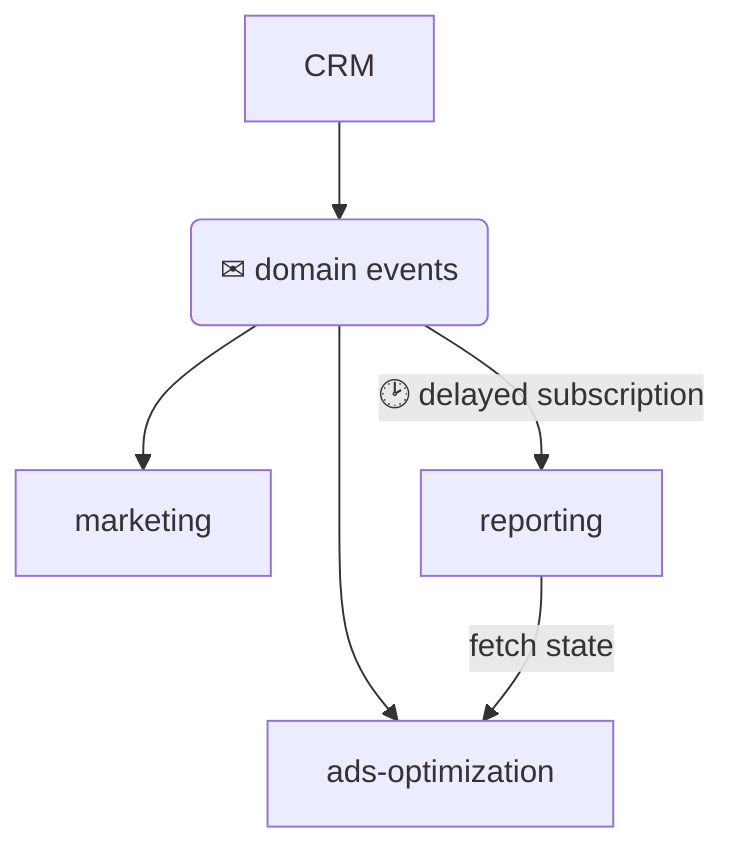
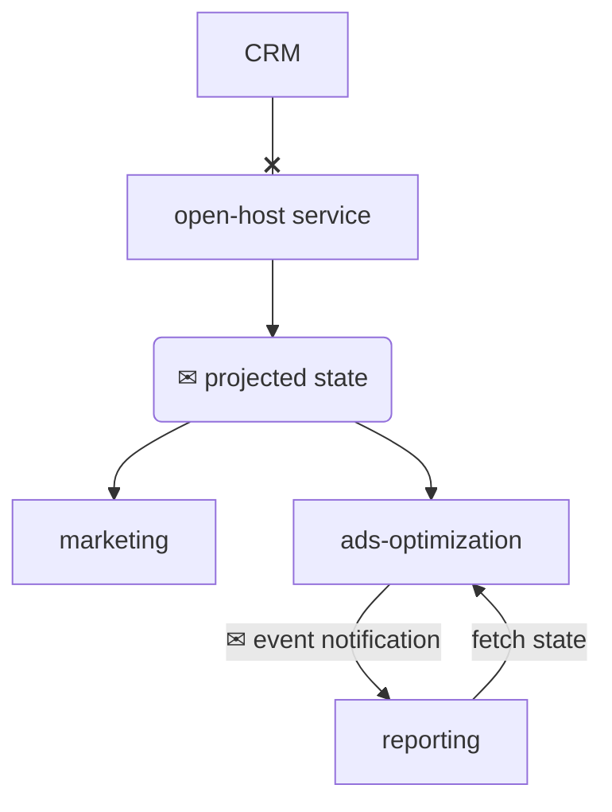

# Event-driven architecture  



It's an architectural style in which components of a system communicate asynchronously by exchanging event messages. It's important to note that while an event is a message, a message is not necessarily an event:

* **event** - a message describing something that has already happened
* **command** - a message describing an operation that has to be carried out

## Types of events  

* **event notification** - something important has happened but requires the consumer to query the producer for more information
* **event-carried state transfer** - it contains a snapshot of a state that can be used to maintain a local cache
* **domain event** - describes an event in the business domain of the producer

### Event-notification  

Should not carry all the information, but just the minimum required for the subscriber to react.  

```python
event_notification = {
    "type": "marriage-recorded",
    "person_id": 123456,
    "payload" : {
        "link": "/person/123456/marriage-data/"
    }
}
```



It is **secure** in that it forces the consumer to query the producer explicitly, proving they have the required authorization and permissions, instead of passing sensitive information. Moreover the information could be stale when it reaches the consumer, if the information is sensitive to **concurrency** e.g. race conditions, querying it explicitly lets you fetch the up-to-date state.  

### Event-carried state transfer  

Conceptually is an asynchronous data replication mechanism allowing the consumer to maintain a local cache. It's more fault tollerant as the consumer can continue to function even if the producer is not available. It should contain all the data reflecting the change in state.  

```python
ecst = {
    "type": "personal-details-changed",
    "person_id": 123456,
    "payload" : {
        "new_last_name": "Williams"
    }
}
```

### Domain event  

The data in a domain event is not supposed to describe the aggregate's state, but rather describe a business event that happened during its lifecycle.  

```python
domain_event = {
    "type": "married",
    "person_id": 123456,
    "payload" : {
        "assumed_partner_last_name": True,
    }
}
```

The `marriage-recorded` event contains minimal info about the event, and the consumer has to query the producer for more details. The `personal-details-changed` event contains the state change without explaining the reason. Finally the `married` event describes what happened in business domain terms.  

# Design event-driven integrations  



The system in the diagram shows that *marketing*, *ads-optimization* and *reporting* are all subscribed to the same domain events produced by *CRM*. Since *reporting* context uses the same events as *ads-optimization*, a five minutes delay has been introduced such that *reporting* will fetch the data only after *ads-optimization* has done its processing.  


#### Temporal coupling  

What if:  

* *ads-optimization* is overloaded and is unable to finish in five minutes ?
* a network issue is delaying the message delivery to *ads-optimization* ?
* *ads-optimization* is down and stopped processing entirely ?

If the order of execution is reversed *reporting* will procude inconsistent data.  

#### Functional coupling  

Both *marketing* and *ads-optimization* are subscribed to the same events and ended up implementing the same data projection for a duplicated business functionality. If the business functionality changes both components will have to change.  

#### Implementation coupling  

By being subscribed to the same domain events, if an event changes or a new one is added, this will have to be reflected in the subscribed bounded contexts e.g. a new event could potentially affect *marketing*'s projected models and by implication *ads-optimiziation*'s too.  


## Refactoring the integration  

The **implementation** and **functional** coupling could be addressed by introducing a consumer-driven contract. The producer will be in charge of implementing relevant events as well as providing the required projections.  Consumers will get what they need without being aware of any implementation detail. While the **temporal** coupling could be tackled by making *ads-optimization* to publish events for *reporting*.  



*Event-driven* means the system relies on the successful delivery of the messages, so when designin such systems is a safe to assume that:

* network is going to be slow
* servers will fail at the most inconvenient moment
* messages will arrive in the wrong order
* messages will be duplicated

To address some of these issues you can:

* use the outbox pattern to ensure messages are published reliably
* ensure consumers can de-duplicate messages and indentify and reorder messages out-of-order  
* use saga and process manager pattern to orchestrate multi-bounded context processes


