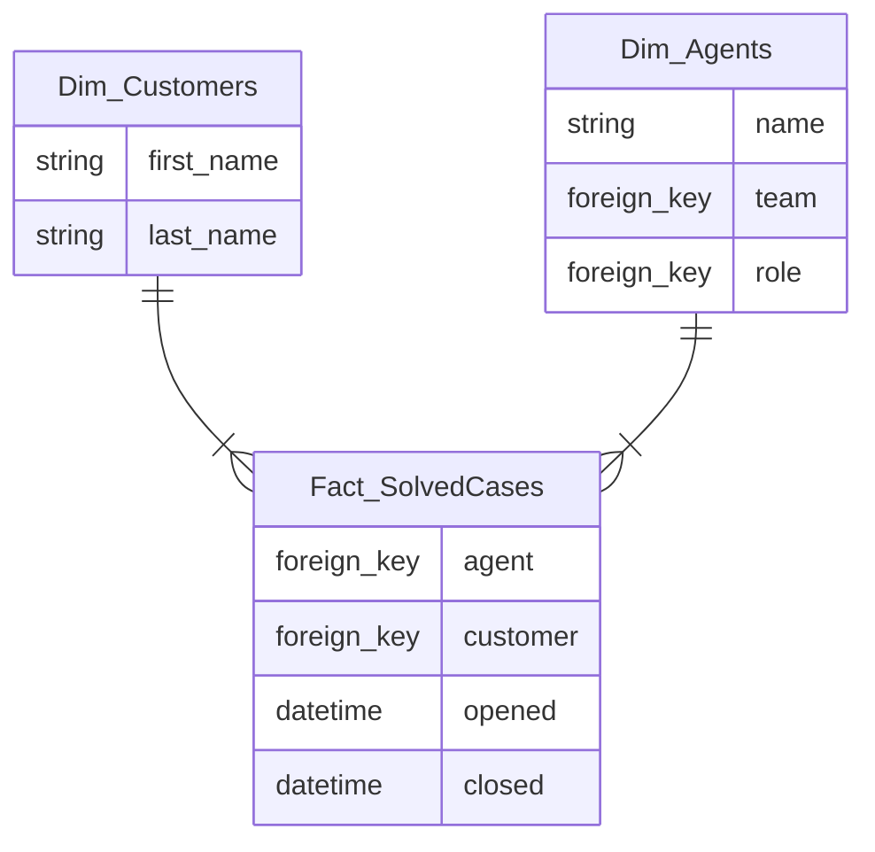

# OLTP vs OLAP  

The *OnLine Transactional Processing Data* (**OLTP**) are operational models are built around busines domain entities, implementing their lifecycles and orchestrating their interactions, they serve operational systems, hence are optimized for real-time business transactions.  

The *OnLine Analytical Processing Data* (**OLAP**) are analytical models designed to provide insights into the system, the performance of business activities and how operations can be optimized to achieve a greater value. This pattern focuses on business activities by modelling **fact tables** and **dimension tables**.  

## Fact tables  

| id  | case_id | timestamp           | agent | customer | status |
| --- | ------- | ------------------- | ----- | -------- | ------ |
| 1   | 13      | 2024-09-01T10:00:00 | 1     | 345      | 1      |
| 3   | 13      | 2024-09-01T10:30:00 | 1     | 345      | 1      |
| 7   | 13      | 2024-09-01T11:00:00 | 1     | 345      | 2      |

Fact tables represent business events that have already happened. Fact records are never deleted or modified (append only). While *OLTP* is concerned with precise data to handle business transactions, *OLAP* is more interesed in aggregate data. The analysts decides the appropriate level of granularity (see *Fact_CaseStatus* has a snapshot every 30 minutes).  

## Dimension tables  

While fact tables represents business processs or actions, dimensions' tables are designed to describe facts' attributes. Querying patterns of analytical models are much more difficult to predict, therefore high normalization is required to support flexible querying.  
