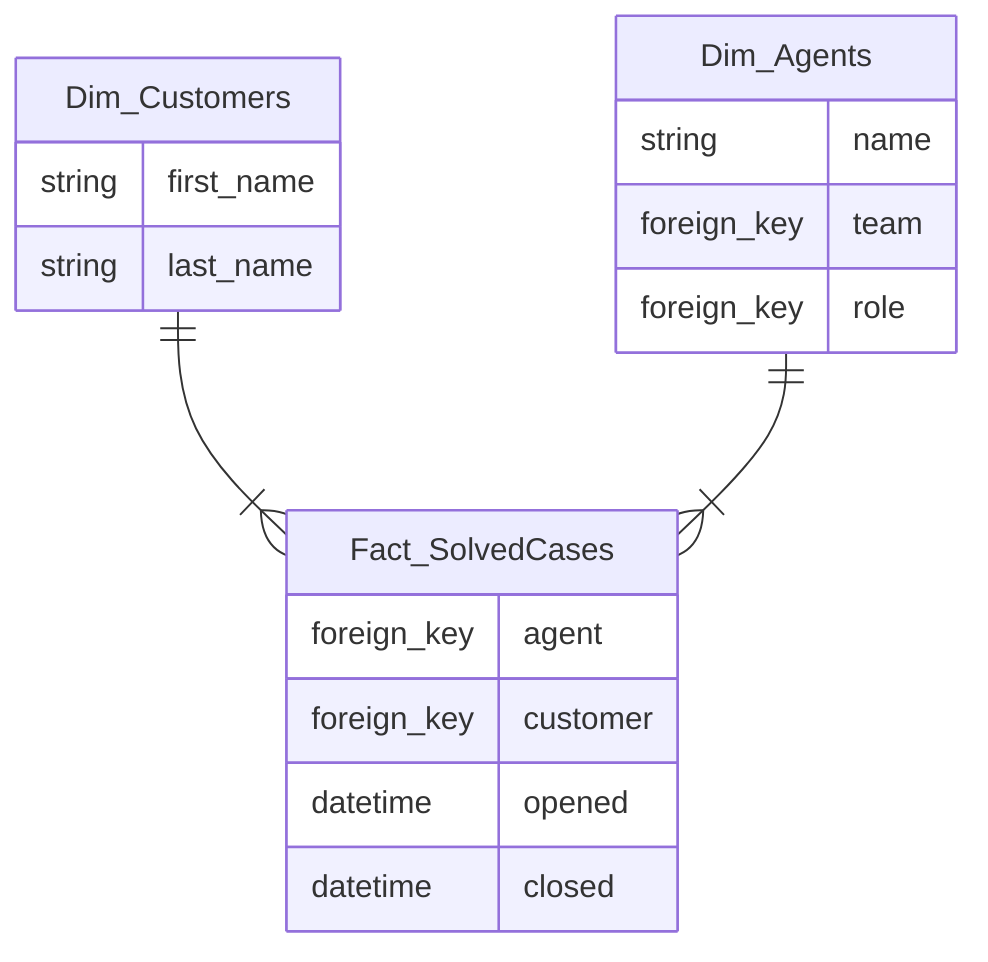
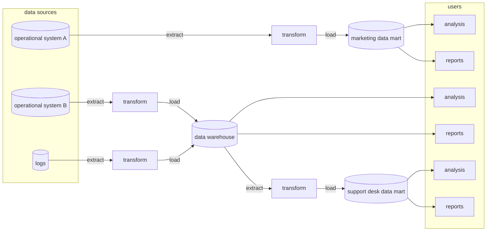
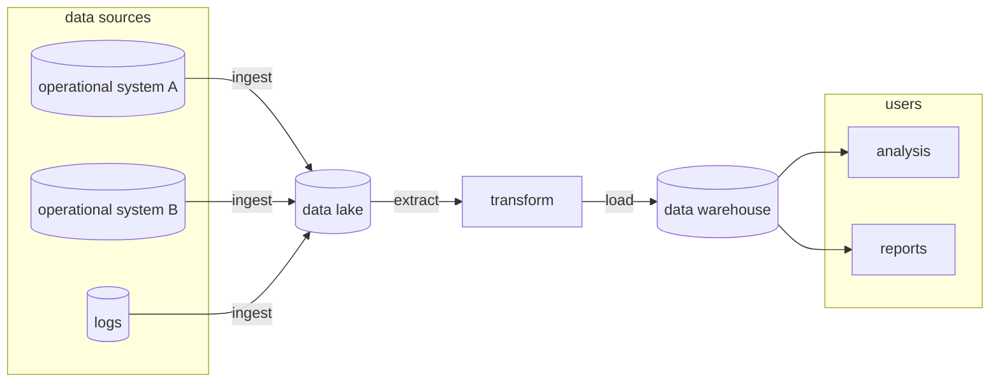
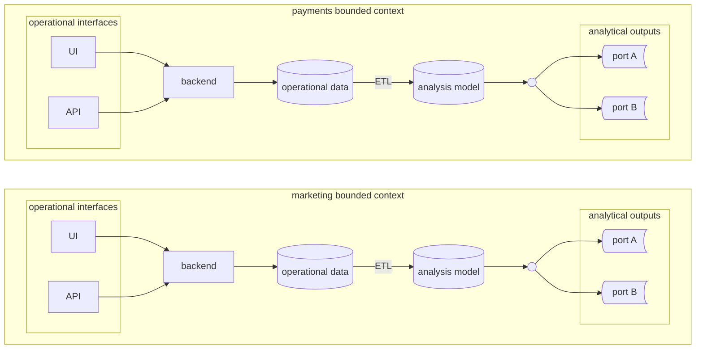

# OLTP vs OLAP  

The *OnLine Transactional Processing Data* (**OLTP**) are operational models are built around busines domain entities, implementing their lifecycles and orchestrating their interactions, they serve operational systems, hence are optimized for real-time business transactions.  

The *OnLine Analytical Processing Data* (**OLAP**) are analytical models designed to provide insights into the system, the performance of business activities and how operations can be optimized to achieve a greater value. This pattern focuses on business activities by modelling **fact tables** and **dimension tables**.  

## Fact tables  

| id  | case_id | timestamp           | agent | customer | status |
| --- | ------- | ------------------- | ----- | -------- | ------ |
| 1   | 13      | 2024-09-01T10:00:00 | 1     | 345      | 1      |
| 3   | 13      | 2024-09-01T10:30:00 | 1     | 345      | 1      |
| 7   | 13      | 2024-09-01T11:00:00 | 1     | 345      | 2      |

Fact tables represent business events that have already happened. Fact records are never deleted or modified (append only). While *OLTP* is concerned with precise data to handle business transactions, *OLAP* is more interesed in aggregate data. The analysts decides the appropriate level of granularity (see *Fact_CaseStatus* has a snapshot every 30 minutes).  

## Dimension tables  

While fact tables represents business processs or actions, dimensions' tables are designed to describe facts' attributes. Querying patterns of analytical models are much more difficult to predict, therefore high normalization is required to support flexible querying.  

## Analytical models  

  

We have the star schema on the right, based on the many-to-one relationship between facts and dimenstions. While on the left we have the snowflake schema, essentially the same but with higher normalization, which allows for more flexibility but requires more complex joins and so more computational power.  

# Analytical data management platforms  
## Data warehouse  

The data warehouse architecture is based on extract-transform-load scripts (**ETL**). The data can come from various sources and it's transformed into an enterprise-wide model that supposedly address all the different analytical use cases. When a specific analytical need that can't be served by the enterprise-wide model arise, it's possible to use a database to hold a specific model, these are called **data marts**.  

## Data lake  

While data warehouses store structured data, a data lake is a centralized repository that allows you to store unstructured data at any scale. Both data warehouse and lakes tend to break under the weight of *big data*, leading to thousands of unmantainable ad-hoc ETL scripts. They also trespass the boundaries of the operational systems creating dependencies on their implementation details.  

## Data mesh  

This kind of architecture in a way is domain-drive design for analytical data. The responsibility of generating the analytical data now belongs to the corresponding product team. By utilising a *data as a product* principle, the team ensures the analytical model addresses the needs of its consumers and serve the data thorugh well-defined output ports. This architecture enables autonomy by creating an ecosystem where product teams creates their own data products and consumes data products served by other teams (and potentially their own too). A federated governance body will be responsible to design rules to ensure interoperability and ecosystem thinking throughout the enterprise.  

